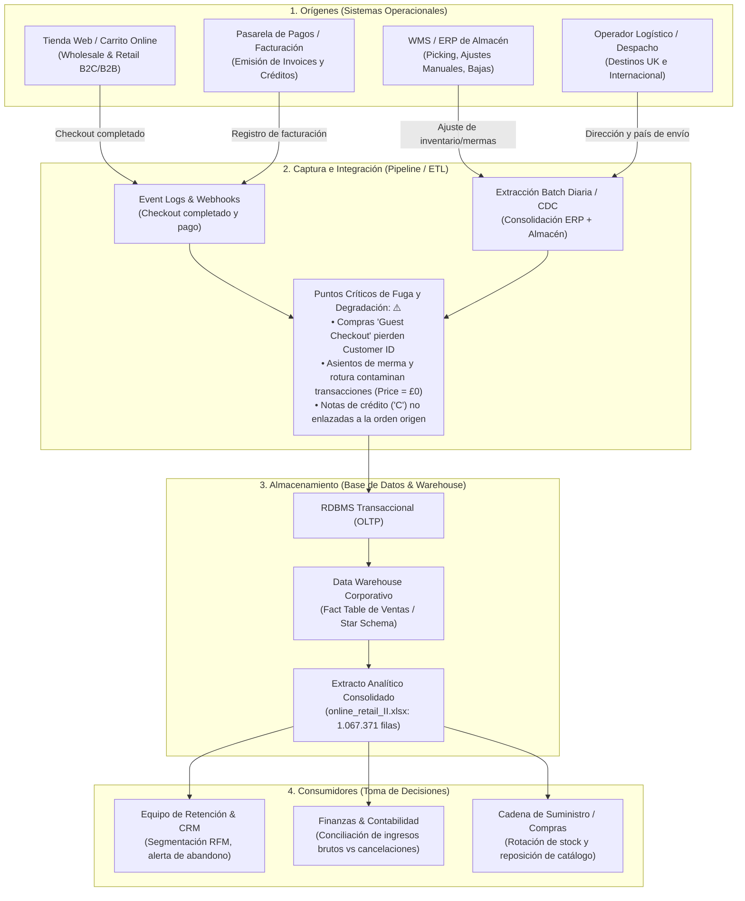

# online_retail_breakdown

# Ecosistema de Datos, Calidad y Pregunta de Negocio

Laboratorio de Modelos Analíticos para la Toma de Decisiones (89354-2026-2C - División A)  
Instituto Superior Tecnológico Empresarial Argentino (ISTEA) — Tecnicatura Superior en Ciencia de Datos e Inteligencia Artificial  
[Online Retail II (UCI Machine Learning Repository)](https://archive.ics.uci.edu/dataset/502/online+retail+ii)  
Grupo 1 (3 integrantes)

---

## 1. Diagrama del Ecosistema de Datos

El dataset `online_retail_II` es un extracto analítico de las ventas minoristas y mayoristas de una distribuidora de regalos y artículos del hogar ubicada en el Reino Unido. No representa una tabla aislada, sino la consolidación de cuatro subsistemas operacionales.



### Puntos de Fuga y Degradación del Dato
1. **Pérdida de identidad por compra anónima (*Guest Checkout*):** La tienda online no obliga a iniciar sesión para transaccionar. La pasarela emite factura válida, pero sin identificador de usuario, generando **243.007 registros (22,77%) huérfanos de `Customer ID`**.
2. **Contaminación por asientos de depósito en el ERP:** El personal de almacén utiliza la misma estructura transaccional para cargar roturas, mermas o deudas incobrables (`damaged`, `check`, `lost`), introduciendo filas con **`Price = 0.00`** o descripciones informales no comerciales.
3. **Desacople en Notas de Crédito:** Las cancelaciones (`Invoice` iniciado en `C`) ingresan con cantidades negativas pero sin clave foránea que vincule la reversión a la fila original de la compra.

---

## 2. Granularidad de la Tabla

> **Cada fila de la tabla representa un ítem individual (línea de pedido) contenido dentro de una transacción comercial o nota de crédito, efectuada en un momento temporal específico.**

* **Verificación cuantitativa:**
  * Total de filas: **1.067.371**.
  * Facturas únicas (`Invoice` distintos): **53.628**.
  * Promedio de líneas de pedido por factura: **19,90** (`1.067.371 / 53.628`).
  * El identificador `Invoice` se repite naturalmente debido a que las ventas son compras multiproducto típicas de un canal de regalos y mayorista.

---

## 3. Diccionario de Datos

| Campo | Tipo de Dato | Descripción y Unidad | Sistema de Origen Probable | ¿Aporta al problema? |
| :--- | :--- | :--- | :--- | :--- |
| `Invoice` | Texto / Categórico | Código alfanumérico único de 6 dígitos que identifica la orden. Si inicia con 'C', representa una cancelación. | Pasarela de Pago / ERP Contable | **Sí:** Permite agrupar ítems por compra y aislar devoluciones. |
| `StockCode` | Texto / Categórico | Código de 5 o 6 dígitos que identifica unívocamente el producto o servicio en catálogo. | CMS E-Commerce / Catálogo WMS | **Sí:** Identifica variedad de canasta y detecta ítems no comerciales (ej. 'POST', 'M'). |
| `Description` | Texto | Nombre descriptivo del artículo en inglés. | Catálogo de Productos | **NO APORTA:** Es texto libre altamente redundante con `StockCode`. Contiene errores de tipeo manual y comentarios de inventario. No se utiliza para modelos transaccionales cuantitativos. |
| `Quantity` | Entero | Cantidad de unidades transaccionadas del ítem en la orden (Unidades). | Carrito Web / Picking WMS | **Sí:** Esencial para cuantificar el volumen de compra y calcular el monto facturado. |
| `InvoiceDate` | Fecha y Hora | Timestamp exacto de emisión de la transacción (`YYYY-MM-DD HH:MM:SS`). | Servidor Web / Base Transaccional | **Sí:** Variable cronológica crítica para ordenar eventos y medir recencia (días sin comprar). |
| `Price` | Decimal / Flotante | Precio unitario del artículo en Libras Esterlinas (£). | Módulo de Precios / Facturación | **Sí:** Componente necesario para el cómputo de facturación. |
| `Customer ID` | Numérico / String | Identificador unívoco del cliente registrado (5 dígitos). | Módulo de Cuentas / CRM | **Sí:** Identificador principal que permite consolidar transacciones por persona. |
| `Country` | Texto / Categórico | País de facturación o despacho del cliente. | Checkout Web / Operador Logístico | **Sí:** Permite segmentar el comportamiento doméstico (UK) de clientes internacionales. |
| `monto` | Decimal / Flotante | Importe total de la línea en Libras Esterlinas (£), producto de `Quantity * Price`. | Feature Engineering / Pipeline | **Sí:** Variable sumable que representa el valor monetario de la transacción. |

* **Dato legítimamente raro vs. Error:**
  * *Legítimamente raro:* Compras con `Quantity > 1.000` con `Customer ID` presente y precio unitario estándar. Corresponden al comportamiento habitual de clientes mayoristas (*wholesalers*).
  * *Error de calidad:* Filas con `Price <= 0` asociadas a descripciones manuales (`damaged`, `adjust`, `lost`). Son asientos de ajuste interno que contaminan el historial comercial.

---

## 4. Informe de Calidad y Bitácora de Decisiones

### Verificación de la Ficha del Catálogo
* **Filas brutas consolidadas:** 1.067.371 (525.461 en Hoja 1 + 541.910 en Hoja 2).
* **Rango temporal verificado:** `2009-12-01 07:45:00` a `2011-12-09 12:50:00`.
* **Identificadores únicos de cliente:** 5.881 clientes distintos (`Customer ID` no nulos).
* **Filas promedio por cliente registrado:** 140,17 líneas de transacción por cuenta.

### Bitácora de Decisiones de Limpieza

| Problema de Calidad | Magnitud | Decisión | Criterio | Impacto en Filas | Evaluación Criterio Opuesto |
| :--- | :--- | :--- | :--- | :--- | :--- |
| **Registros Duplicados Exactos** | 34.335 filas idénticas (3,22%). | **Eliminar**, conservando el primer registro. | Reintentos de sincronización o duplicación en el volcado batch del ETL. | -34.335 filas | Conservarlos sobrestimaría la facturación real del negocio en más de £1.000.000 y distorsionaría la frecuencia real de los clientes. |
| **Registros sin Cliente (`Customer ID` nulo)** | 243.007 filas (22,77%). | **Descartar para el modelo de clientes / retención.** | Imposible rastrear la historia de una persona si la transacción no tiene identidad (*Guest Checkout*). | -239.542 filas (netas post-duplicados) | Imputarles un ID único (ej. "99999") crearía un "supercliente" artificial que distorsionaría drásticamente los cálculos de recencia y frecuencia. |
| **Cancelaciones (`Invoice` con prefijo 'C')** | 19.494 filas en total (18.744 con Customer ID). | **Filtrar** para la conformación de la tabla de compras activas. | Para modelar la intención de compra recurrente y el riesgo de abandono se debe aislar la actividad de compra genuina. | -18.744 filas | Conservar cantidades negativas en el cálculo de tickets promedio generaría tickets desvirtuados o importes netos negativos que rompen distribuciones en modelos predictivos. |
| **Precios Nulos o Cero (`Price <= 0`)** | 6.207 filas en el set bruto. | **Excluir.** | Movimientos de ajuste contable o merma física de stock, sin valor comercial. | 0 filas adicionales (quedan descartadas en los pasos previos). | Conservarlas sumaría registros que no corresponden a ventas reales del negocio. |

---

## 5. Pregunta de Negocio y Análisis de Brecha

### Pregunta de Negocio
> **«De los clientes que realizaron dos o más compras durante el período 2009–2010, ¿qué proporción no volvió a comprar durante el segundo semestre de 2011 y qué umbrales de recencia y caída en frecuencia anticipan ese abandono para que el área de Cuentas Mayoristas y Fidelización despliegue promociones preventivas?»**

* **A quién le sirve:** A la Gerencia Comercial y al Equipo de Fidelización / CRM B2B.
* **Para decidir qué:** Asignar ejecutivos de cuenta directos y beneficios comerciales antes de que las cuentas mayoristas migren hacia proveedores competidores.

### Análisis de Brecha (Datos faltantes necesarios)
1. **Costo de Mercadería Vendida (CMV / Margen unitario):** El dataset solo cuenta con ingresos brutos (`Price`). Sin el costo, no se puede calcular el Margen de Contribución por cliente, impidiendo priorizar el esfuerzo de retención sobre los clientes más rentables.
2. **Categoría Jerárquica del Producto:** `StockCode` y `Description` no tienen familia o departamento estandarizado. Contar con categorías permitiría detectar si un cliente abandona porque dejó de consumir una categoría puntual que quedó sin stock.
3. **Motivo de Cancelación y Canal de Reclamo:** Para las órdenes revertidas no se documenta si la devolución se debió a fallas del producto, demoras logísticas o arrepentimiento, lo que impide separar la deserción por fricción operativa de la deserción comercial.

---

## 6. Instrucciones de Reproducibilidad

1. Clonar el repositorio:
   ```bash
   git clone [https://github.com/tu-usuario/tp1-ecosistema-online-retail.git](https://github.com/tu-usuario/tp1-ecosistema-online-retail.git)
   cd tp1-ecosistema-online-retail
   ```
2. Abrir el notebook en Google Colab o Jupyter:
   * El script descarga automáticamente el archivo oficial `online_retail_II.zip` desde el repositorio de UCI Machine Learning, extrae ambas hojas de cálculo, aplica la bitácora de limpieza y construye la tabla a nivel cliente (`RFM`).
