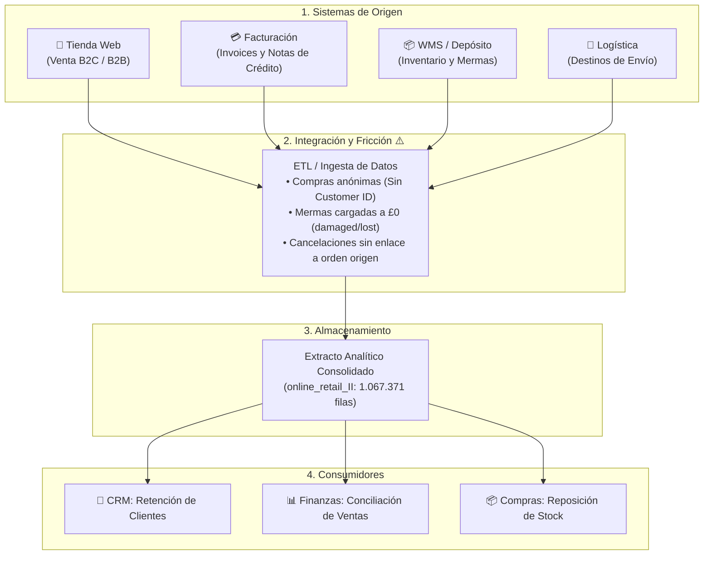

Identificar los orígenes de datos no es mágica: lo hacés combinando **lo que te dice el negocio**, **lo que te pide la materia** y **lo que te delatan las columnas raras del CSV**.

---

**1. Primero: qué te dice UCI sobre el negocio**

En el repositorio de UCI viene toda la info sobre de dónde salió el archivo `online_retail_II`:

* Es una empresa inglesa que vendía por internet (sin tienda física) entre 2009 y 2011. Nada de locales, todo online.

* Vendían regalos y decoración, tanto a clientes normales como a mayoristas que compraban para revender.

* Como no tenían tienda física, todo pasaba por su **sitio web / plataforma de e-commerce**.

---

**2. Lo que nos pide la materia**

El TP es bien claro: hay que reconstruir el **ecosistema completo** detrás del archivo, no solo ver el CSV. En palabras del profe:

> *«No es solo el archivo. Si el dataset son reseñas de Amazon, atrás hay un catálogo, un sistema de pagos, vendedores, un motor de recomendación... El CSV es solo la punta del iceberg. Ustedes tienen que pensar en TODO ese sistema.»*

Lo que pide es: tracemos el camino del dato desde que un cliente hizo clic en "Comprar" (o un empleado registró algo en el almacén) hasta que eso terminó como una fila en la tabla.

---

**3. La ingeniería inversa: leer las "pistas" de cada columna**

Acá viene lo copado: cada columna es una pista que te dice qué sistema generó esos datos:

* **La Tienda Web / Módulo de Usuarios:**
  - *Columna:* `Customer ID`.
  - *La pista:* Tenemos 824.364 filas con ID de cliente, pero 243.007 están vacías (`NaN`). Eso es un 22,8% de nulos. ¿Por qué? Porque la tienda web permite comprar sin registrarse (Guest Checkout). Alguien clickeó "comprar como invitado" en lugar de loguearse.

* **Sistema de Facturación / Pagos:**
  - *Columna:* `Invoice`.
  - *La pista:* Son códigos de 6 dígitos consecutivos. Pero 19.494 registros comienzan con 'C' (como `C489449`). Solo un sistema contable formal emite *Credit Notes* (notas de crédito) para devolver dinero o anular compras. Eso no lo hace un cliente, lo hace un sistema.

* **El Almacén / Sistema de Inventario (WMS/ERP):**
  - *Columnas:* `StockCode`, `Description`, `Price`, `Quantity`.
  - *La pista:* Si mirás bien, hay filas con `Price = 0.0` y descripciones raras como "damaged" (roto), "lost" (perdido), "bad debt adjustment" (ajuste de deuda). Un cliente nunca compra un producto que se llama "ROTO" a $0. Eso son los operarios del almacén cargando ajustes y pérdidas de inventario directamente en el sistema.

* **Logística / Despacho:**
  - *Columna:* `Country`.
  - *La pista:* Es el país a donde viaja el producto (UK, Alemania, Francia, etc.). Se genera cuando alguien completa el formulario de envío y el sistema calcula el costo del courier internacional.

---

*«¿De dónde sacamos que esos son los orígenes si el archivo no lo dice?»*

> "Básicamente, deducimos por ingeniería inversa. Sabemos que hay tienda web porque UCI lo dice y porque un 22% de transacciones sin `Customer ID` delata un checkout anónimo. Sabemos que hay sistema contable porque los invoices con 'C' son Credit Notes formales. Y sabemos que el almacén volcó datos directamente porque hay registros a $0 con descripciones de mermas (`damaged`, `adjust`) que solo un operario carga cuando falta o se rompe algo."

---
